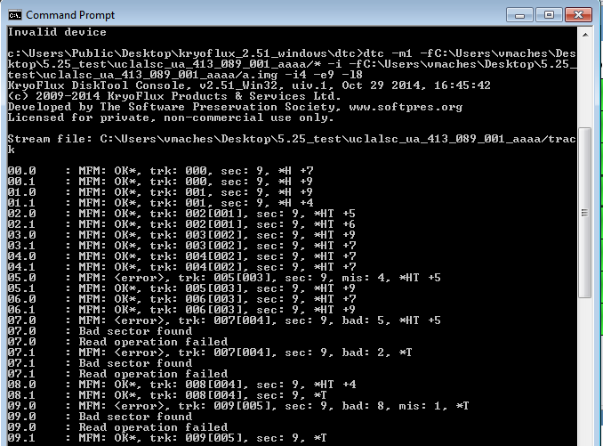
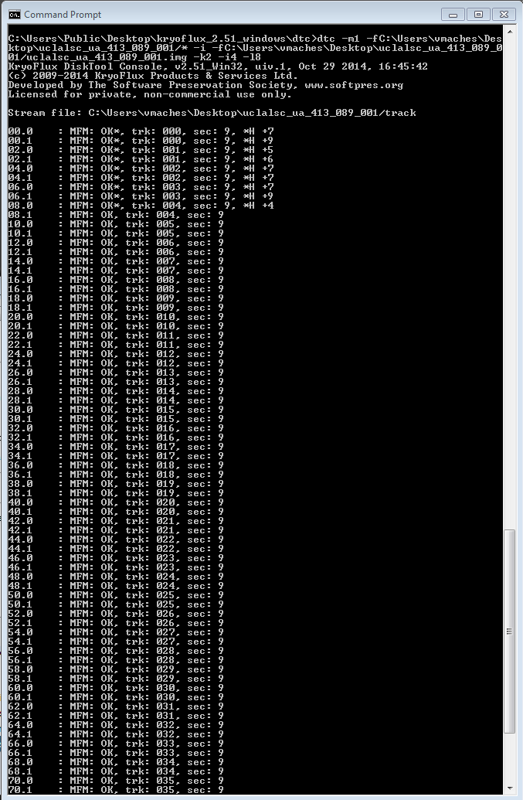
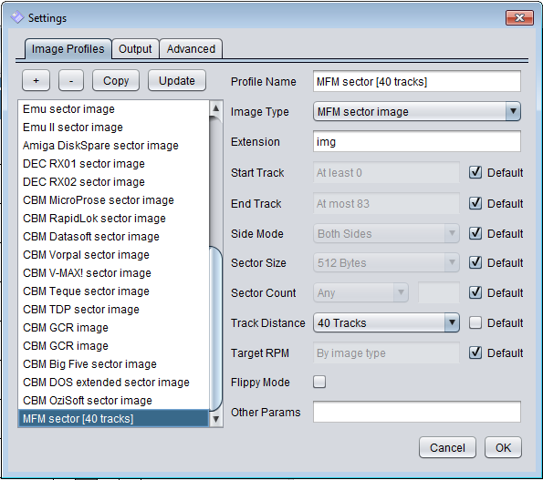
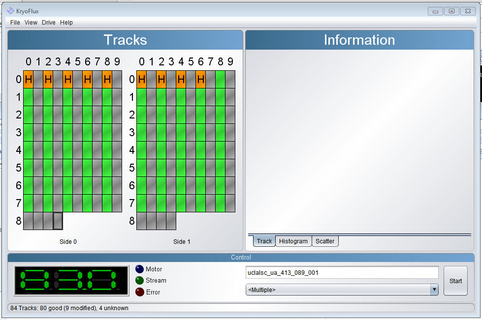

# Working with 40-Track Floppy Disks

## What are 40-track disks?

The magnetic medium inside a blank floppy disk is coated with magnetic oxide, with particles in no magnetic order. Formatting the disk aligns these particles into a pattern of tracks, which are concentric rings divided into sectors that represent locations where data is stored, with empty space between the rings. This also represents the structure that the stored data follows. Until the mid-1980s, floppy disks typically had 40 tracks each. These tracks were widely-spaced enough that drives would not accidentally overwrite data or write data to the wrong track by mistake. After the mid-1980s, changes in technology halved the physical distance needed between tracks, so more tracks (and data) could fit onto a disk. Floppy disks usually had 80 tracks after this point. 

The KryoFlux’s software images 80-track disks by default, and will not automatically image 40-track disks correctly. If you have a 40-track disk, you’ll need to change the GUI’s settings or image the disk using the command line interface in order to image it correctly.

Reading a 40-track disk with an 80-track drive can be difficult, since 80-track drives were generally not designed for this, but there are workarounds once you know you have a 40-track disk. 

It can be difficult to identify a 40-track disk. One clue can be found by checking the disk’s label, since some 40-track disks are labeled “48 tpi,” or 48 tracks per inch. This refers to the density of the tracks on the floppy. If the label says “48 tpi,” you can confirm that it is a 40-track disk via the command line and/or the GUI (see next section).

## How to tell if you have one

40-track disks can often be identified in the GUI by the distinctive sector pattern they exhibit during imaging, wherein every other track is bad or unintelligible, as shown below. **If you notice this pattern while imaging is underway, it’s important not to stop the process until it is finished, since stopping during imaging can damage the drive.**

*Figure 1: DTC GUI. Note that every other track on side 0 is bad; this is a sign that the floppy disk is likely a 40-track disk.*

In the above image, the pattern occurs because the drive detects “crosstalk”, or magnetic noise between tracks. The drive expects to see a new track, but does not find one because the disk has 40 wider tracks instead of 80 narrower tracks. The drive/KryoFlux may try to read tracks that shouldn’t have readable data on a 40-track disk (the odd-numbered tracks), resulting in every other track appearing to be bad.

In order to confirm that this pattern indicates a 40-track disk, you will need to use the command line. 

In the command line, navigate to the folder containing the DTC executable file, and enter:
::
  dtc -m1 -fpath\to\STREAM\file/* -i -fpath\to\MFMimageFile/new_image_filename.img -i4 -l8

This will create an MFM image of the disk from stream files. (We chose to create an MFM image because we thought this was the most likely format for the disk we were imaging, and the output confirmed that we were right. If another format is more likely, the command you enter to image the disk will be slightly different. See Using and interpreting DTC via the CLI for more information.) 

Then look at the output:

*Figure 2: STDOUT to console.*

After the first few lines, each line should look something like this:
::
  02.0      :  MFM OK*, trk: 002[001], sec: 9, *HT      +5

Here, *02.0* is the track number, and *MFM OK** means that the disk is MFM-formatted, so the MFM image will work. *Trk:  002* means that the software expects to find track 2, and [001] means that it found track 001 instead. 

The number after *trk:* and the number in the bracket will depend on the track. If there is a number in brackets, then the disk is a 40-track disk. This is because the brackets won’t appear if the track number matches the number after trk. If they do not match, then the track number the program found will be listed in the brackets, and you’ll know you have a 40-track disk.

In the output, *H* stands for header gap. If there’s a header gap, that means that the track has been modified (in other words, the user wrote something to it) so it has data that we want. *T* represents the track warning, which is when the track number the software finds doesn’t match the track number it should find. Each line of output also includes a number that represents the number of modified sectors on that track. In this case, there are 9 modified sectors.

An additional sign that you have a 40-track disk instead of an 80-track disk is that, after the first few tracks, every other track returns three lines: one that looks like the line shown above, but with MFM <error> instead of MFM OK*, one that says “Bad sector found,” and one that says “Read operation failed.” This is because there’s no track for the software to read.

The following breaks down the sample line of output described above, and explains what each part means:

* **02.0  :**: Track number
* **MFM**: Check for MFM Formatting
* **OK***: Disk is MFM-formatted
* **trk: 002**: Expecting to find track 2
* **[001],**: Finds track 1 instead (difference signifies 40-track disk)
* **sec: 9,**: 9 modified sectors
* ***HT**: Header gap (track has been modified), Track warning

## Imaging 40-track disks

### Command line

From the command line, navigate to DTC. Type in: 
::
  dtc -m1 -fpath\to\STREAM\files/* -i -fpath\to\new\image\file/new_image_filename.img -k2 -i4 -l8 
This tells the KryoFlux to create an MFM image of a 40-track disk from stream files. -k2 sets the track distance to 2, so DTC will image every other track (40 tracks instead of 80), and skip the parts of the disk that do not contain data. The screenshot below shows what this will look like in the command line.

*Figure 3: STDOUT to console imaging a 40-track floppy.*

### GUI

To image 40-track disks, you will need to change some settings. You can create an imaging profile in the *Settings* tab to save these settings, and avoid having to change them manually every time you encounter a 40-track disk. 

To do this:

1. Go to *File > Settings > Image Profiles* in the GUI. 

2. Make sure you’re using the most up-to-date image profile for each format. To update the image profiles:
 
* Select each profile and click the minus sign to delete it. 
* Once you have deleted all the profiles, click Update to replace them with the most recent versions. 

*Figure 4: The Image Profiles window in the DTC GUI.*

Once the profiles are up to date, it’s time to create a 40-track version of the profile you need. If this version is lost, deleted, or changed, you can create another one using these instructions. 

3. Select the format of the disk you’re imaging (MFM sector, etc.) and click Copy. This will copy the image profile you want, so that you can change settings within the copy to accommodate a 40-track disk in that format, instead of having to create a profile from scratch.

4. In the *Settings* for the copy (on the right-hand side of the window), change the *Profile Name* to “[format] [40 tracks]” (e.g. “MFM sector [40 tracks]”), and unclick the Default box next to Track Distance. Change the *Track Distance* to *40 Tracks* in the pulldown menu. Click *OK*. 

*Figure 5: The Image Profiles window in the DTC GUI showing a 40-track profile.*

5. Every time you image a 40-track disk with the GUI, select the 40-track copy of the image profile you want to use in addition to preservation stream files. Then, create your disk image in the GUI as usual. The displayed result will look something like the screenshot below, with every other track unintelligible. This means the 40-track disk was imaged correctly.

.. image:: 

*Figure 6: The DTC GUI showing a successfully created 40-track disk image*
